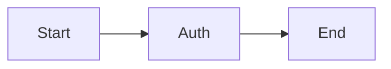

sense 感觉
rather than 而不是
alternative 选项
suggest 建议
offer 提供
solution 解决方案 
status 地位
similar 相似的
circumstance 状况
uncomfortable 不舒服的
accept 接受 
acceptable 可接受的 
discuss 讨论 
financial 经济的 
receive 接收
solve 解决
# 定位词
*不容易被替换的，容易找的*
- 人名地名
- 数字 2009
- 特殊符号 “”
- 特殊字体 

# 判断题考点
- more than / rather than
- most / only / first 
- 方向性表达 
2. 客观信息
	- 介词短语
	- 逻辑关系

